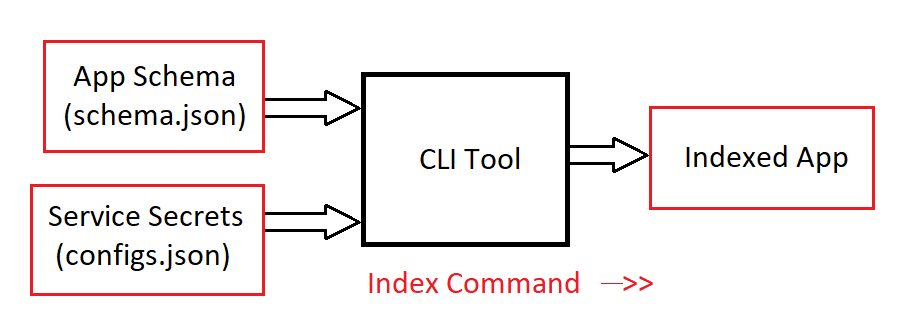

# Cognitive Search Integration

Our goal is to make your app searchable.
Index your app with just one command, and then use the SearchClient sdk to search for stuff in your document.


## Prepare Your Application

You need to provision the following resources:
 - Blob Container Data Store
	 - which contains your Custom Text documents (read more [here](https://docs.microsoft.com/en-us/azure/storage/blobs/storage-blobs-introduction))
 - Cognitive Search Service
	 - which we use to index and search your application (read more [here](https://docs.microsoft.com/en-us/azure/search/search-what-is-azure-search))
 - AI Enrichment Azure Function
	 - In order to enable custom text (or other services) in the indexing pipeline
	 - This is basically an azure function that when provided with some document, runs the Custom Text prediction endpoint and waits till it gets the classification/entities result 
	 - follow the input format [here](https://docs.microsoft.com/en-us/azure/search/cognitive-search-custom-skill-web-api#sample-input-json-structure), and output format [here](https://docs.microsoft.com/en-us/azure/search/cognitive-search-custom-skill-web-api#sample-output-json-structure) 


## Run the 'Index' command

 - Configs file
	 - Fill the [configs.json](./Docs/Assets/configs.json) file with your service secrets (that you already provisioned)
	 - This configs file needs to be placed next to the cli tool to read it
 - Application Schema
	 - Provide your Custom Text application [schema.json](./Docs/Assets/app-schema.json) in the same provided format
 - Run the index command
	 - Run the index command, and wait till process finishes
```console
clutils index --schema <path/to/your/schema> --index-name <name-your-index-here>
```
- Check process success
	- check your cognitive search resource for the created index, and make sure the indexer runs without errors
    - please file any issues [here](https://github.com/microsoft/CogSLanguageUtilities/issues) if you have any troubles

## Search your app
Use the SearchClient sdk (see docs [here](https://docs.microsoft.com/en-us/azure/search/search-howto-dotnet-sdk#run-queries))
//we need to provide sample codes for search client!


